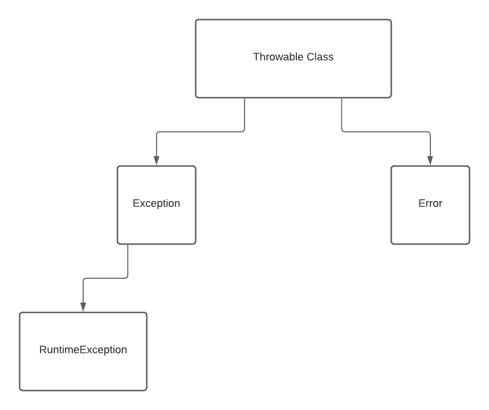

# Exception Handling in Java

## Definitions
- An `exception` is an abnormal condition that occurs at run-time.  
Or we can say that,  
- An `exception` is a run-time error.
- Catching an `exception` in Java and processing it is called `Exception Handling`.
- In Java, we have objects for exceptions that describe the error that has occurred in the code at run-time.

## What happens when an exception (run-time error) occurs?
1. When an exception (run-time error) occurs, an object (which contains information about the exception)
is created and `thrown` in the method that has created the error.  
2. Either the method can "handle" the exception itself, or it can pass it to some other method.
3. At some point, the exception will be `caught` by a method, and will be processed.  
  
**NOTE:**  Exceptions can be automatically generated by the Java Run-Time Environment, or they can be generated manually by the code that we have written.

## Keywords for handling Exceptions in Java
1. `try`.
2. `catch`.
3. `throw`.
4. `throws`.
5. `finally`.

## Hierarchy of Exceptions in Java
  

- The `Throwable` class in the `java.lang` package is the superclass of all exception types in Java.
([`java.lang.Throwable`](https://docs.oracle.com/en/java/javase/14/docs/api/java.base/java/lang/Throwable.html)).  
- The `java.lang.Throwable` class has two direct known subclasses;
 namely, the `Exception` class and the `Error` class, both in the `java.lang` package.
 ([`java.lang.Exception`](https://docs.oracle.com/en/java/javase/14/docs/api/java.base/java/lang/Exception.html),
  [`java.lang.Error`](https://docs.oracle.com/en/java/javase/14/docs/api/java.base/java/lang/Error.html))
- The `java.lang.Exception` class describes the "exceptional conditions" that we should handle in our programs.
- The `java.lang.Exception` class has a subclass called `RuntimeException`, also in the `java.lang` package; 
it describes the types of exceptions that can be automatically handled.
- The `java.lang.Error` class describes about problems that cannot be handled by our programs, these are usually major
system failures like `OutOfMemoryError` or `StackOverflowError`.

## The Exception in the `UncaughtException.java` file
We see the output as (shown in red on the IntelliJ console)
```
Exception in thread "main" java.lang.ArithmeticException: / by zero
	at exceptions.UncaughtException.main(UncaughtException.java:14)
```
Let us understand the above line:
